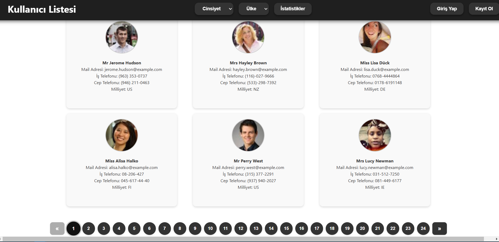
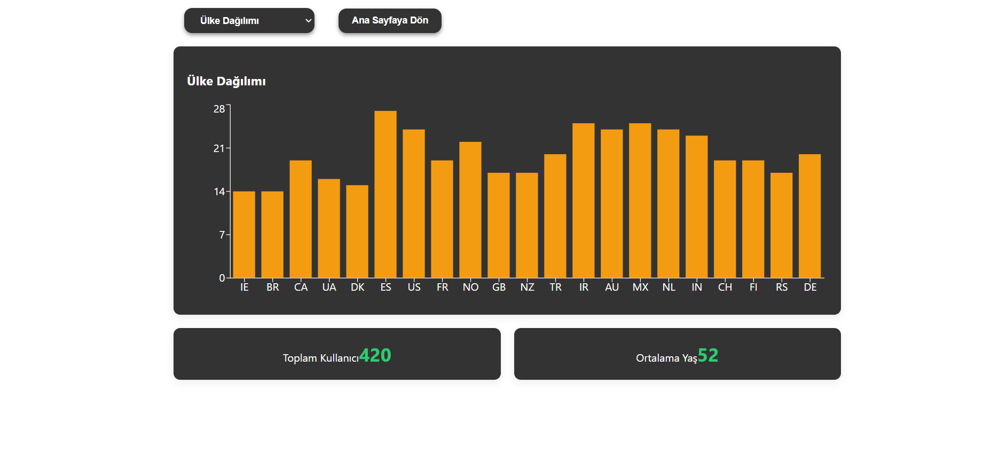
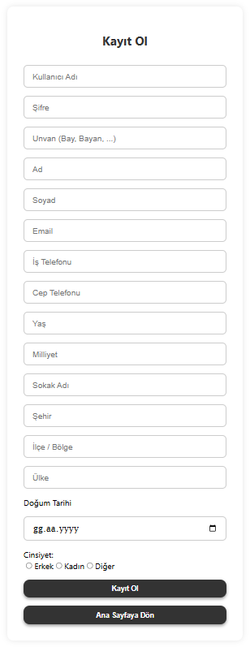

# 📊 UserInsight Analytics

Bu proje, RandomUser API'sinden elde edilen ham verilerin SQL veritabanına entegre edildiği; kullanıcıların güvenli giriş (Auth) yaparak kendi profillerini görüntülediği ve tüm demografik verilerin istatistiksel tablolarla analiz edilebildiği kapsamlı bir Full-Stack (.NET & React) uygulamasıdır."

## 🚀 Öne Çıkan Özellikler

* **Güvenli Kimlik Doğrulama (Auth):** Kullanıcı giriş ve kayıt işlemleri için güvenli altyapı.
* **İstatistik Paneli (Dashboard):** Kullanıcı verilerini anlamlı metrikler halinde sunan analitik arayüz.
* **Lokasyon Analizi:** Kullanıcıların coğrafi verilerinin işlenmesi ve sunulması.
* **Kapsamlı Yönetim:** Gelişmiş CRUD işlemleriyle tam kontrollü kullanıcı listeleme ekranları.

## 🛠️ Teknoloji Yığını

**Backend (API):**
* .NET 8 (Core)
* Entity Framework Core
* Layered Architecture (Katmanlı Mimari)

**Frontend (Client):**
* React.js
* JSX & Modern CSS

## 📂 Proje Mimarisi

Proje, sürdürülebilirlik (maintainability) ve temiz kod (clean code) prensipleri gözetilerek Monorepo yapısında kurgulanmıştır:
* `/RandomUserApi`: Veri tabanı işlemleri, iş mantığı (business logic) ve uç noktaları (endpoints) barındıran RESTful API servisi.
* `/Frontend`: Kullanıcı etkileşimini sağlayan, bileşen (component) tabanlı modern arayüz.

## 📸 Arayüz (Frontend) Özellikleri ve Ekran Görüntüleri

### 👥 Kapsamlı Kullanıcı Listesi ve Dinamik Filtreleme
Sistemdeki tüm kullanıcılar modern kart yapısında listelenir. Ülke, cinsiyet filtreleri ve canlı arama özelliği ile veriler anlık olarak süzülebilir. Sayfalama (pagination) ile performanslı veri gösterimi sağlanır.

### 📊 Demografik İstatistikler ve Dashboard
Veritabanındaki kullanıcıların cinsiyet ve ülke dağılımları dinamik grafiklerle sunulur. Sistemdeki toplam kullanıcı sayısı ve yaş ortalaması anlık olarak hesaplanıp ekrana yansıtılır.

### 🔐 Detaylı Kullanıcı Kayıt Sistemi
Yeni kullanıcıların sisteme dahil edilmesi için detaylı doğrulama (validation) içeren kayıt formu. Buradan eklenen her veri, eşzamanlı olarak API üzerinden veritabanına işlenir ve istatistik tablolarını anında günceller.
 